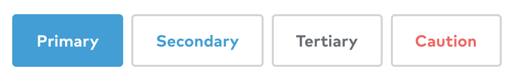

## Description

It's important to make a distinction here: when people talk about buttons in regards to the web, they're probably talking about one of three things:

1. A `<button>` element which, depending on its type attribute (`submit`, `reset` or `button`), triggers some kind of action: submitting a form, clearing a form, or triggering a JavaScript function.
2. An `<input>` element with one of the three types: `submit`, `reset` or `button`. These are functionally almost identical to a `<button>` element with the same type attribute.
3. Any other interactive HTML element that looks like a button, but isn’t a `<button>` element. This category includes ‘call-to-action’ links designed to look like buttons.

In most cases, it’s preferable to use a `<button>` instead of the corresponding `<input>`: With a `<button>` the label text goes between opening and closing tags, allowing you to include other HTML elements inside the label; with `<input>` you’re restricted to using the `value` attribute which only has support for text strings.

If you're interested in the third category, you’re probably either looking for the page on [links](/components/link); or you’re using the wrong element for your buttons (and you should read on to learn why).

## Markup

Here is an example button:

```html
<button type="button">I'm a button, click me</button>
```

The most important thing to note is the `type` attribute; this can be one of the following:

- `submit`: The button submits the form data to the server.
- `reset`: The button resets all the controls to their initial values.
- `button`: The button has no default behaviour and does nothing when pressed; needs a JavaScript event listener attached to it to do anything.

Buttons of type `submit` and `reset` will do nothing if not placed within a form. If there is no type attribute specified, or the type is invalid, the button is treated as if it had `type="submit"`.

As you can probably see, there’s not much markup required here at all, so it’s surprising how often mistakes are made. Here is one commonly used (anti)pattern:

```html
<a href="#">I'm a button, click me</a>
```

By default, this link does nothing but append a '#' to the current URL. If you attach a JavaScript event listener to the element, you can prevent the default behaviour and trigger an action (this example uses jQuery):

```javascript
$('a').click(function(e) {
  e.preventDefault();
  /* your_code_here; */
  return false;
});
```

While this technically achieves its purpose (and is the top answer to this [stack overflow question](https://stackoverflow.com/questions/1070760/javascript-function-in-href-vs-onclick) viewed 1.3million times) it's still a hack. Users expect certain behaviours from links (e.g. middle click to open in new tab) and others from a button (e.g. 'click' with the space key). When those expectations are not met, this can lead to confusion and frustration.

A far worse thing to do would be to use a non-focusable element such as a `<span>`, `<div>` or an `<a>` with a missing `href` attribute. These will not appear in the tab order and are therefore inaccessible to those users who navigate solely using a keyboard.

```html
<!-- Neither of these “buttons” are buttons to assistive technologies -->
<div class="button">I'm a button, click me</div>
<span class="button">I'm a button, click me</span>

<!-- A button with no href is not focusable -->
<a class="button">I'm a button, click me</a>
```

> It’s worth noting that although it is possible to make these non-focusable elements accessible, this is only possible by fully replicating the functionality of the native `<button>` element. This involves using attributes such as `tabindex="0"` (to make the element focusable); ARIA to communicate semantics to assistive technology; and JavaScript event listeners to add keyboard, touch and mouse interactivity. This is a lot of extra work considering the native button element gives you all this behaviour for free.

In Summary:

- Use buttons for performing an action. e.g. ‘Submit’, ‘Delete’, ‘Create’, ‘Hide’
- Give your buttons a `type` attribute
- Make buttons look like buttons (and links look like links)[^1][^2][^3]

## Styling

As well as using the correct element, it's important to make your buttons look and behave like the correct element. As already mentioned, users have certain expectations around how to interact with an element based on its appearance (known as [affordances](https://www.interaction-design.org/literature/topics/affordances)). Here are some techniques you can use to make buttons more obvious to users:[^4]

- Dynamically size the button to fit the text in it
- Keep the text centre-aligned on a single line
- Ensure the button has distinct styles for disabled, hover, focused, active/pressed and default states.
- Unless it appears inside a [button group](/components/button-group) with other options, use whitespace around the button to distance it from other content.
- Make the button big enough so users of touch devices can comfortably use it (a minimum of 10mm in both dimensions)

If it fits within the design of your website, you could also try:

- Give your buttons rounded corners
- Use subtle box-shadows to raise the button above the rest of the page
- Add a gradient background to give it a 3D appearance

If using multiple buttons that you want to give different prominence, style each one differently: **primary** actions should be visually more important-looking than **secondary** actions. Buttons that trigger a potentially negative action such as deleting something can be differentiated with use of the colour red. Consider including a hierarchy of different button styles based on importance.



### A note on `cursor: pointer`

Don't use the CSS property `cursor: pointer` to change the default cursor when hovering over a button — `cursor: pointer` is for links. Your buttons should be designed so a user can tell that they are clickable without a different cursor[^5].

## Usage guidelines

Communicate the purpose of a button clearly and concisely using a text label, an icon, or both. Instead of using generic labels like ‘OK’ or ‘Cancel’, think about what action clicking the button will trigger — if it deletes something, use ‘Delete’; if it places an order, use ‘Place order’.

If using _only_ an icon, you will need to ensure the button has a meaningful label[^6]. This label can be included inside the button and hidden visually using a [screenreader-only](https://www.scottohara.me/blog/2017/04/14/inclusively-hidden.html) CSS class. Alternatively, the label can be linked to the button using the aria attributes `aria-label` or `aria-labelledby`. Keep in mind that even if you find the meaning of an icon obvious, your users may not.

[^1]: [Links vs. Buttons in Modern Web Applications — Marcy Sutton](https://marcysutton.com/links-vs-buttons-in-modern-web-applications)
[^2]: [Proper Use of Buttons and Links](http://www.webaxe.org/proper-use-buttons-links/)
[^3]: [But sometimes links look like buttons (and buttons look like links)](https://medium.com/simple-human/but-sometimes-links-look-like-buttons-and-buttons-look-like-links-9b371c57b3d2)
[^4]: [7 Basic Rules for Button Design](https://uxplanet.org/7-basic-rules-for-button-design-63dcdf5676b4)
[^5]: [Buttons shouldn’t have a hand cursor](https://medium.com/simple-human/buttons-shouldnt-have-a-hand-cursor-b11e99ca374b)
[^6]: [Accessible Icon Buttons — Sara Soueidan](https://www.sarasoueidan.com/blog/accessible-icon-buttons/)
