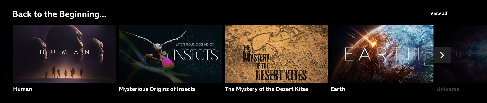
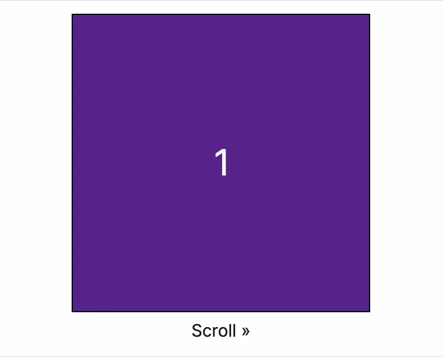
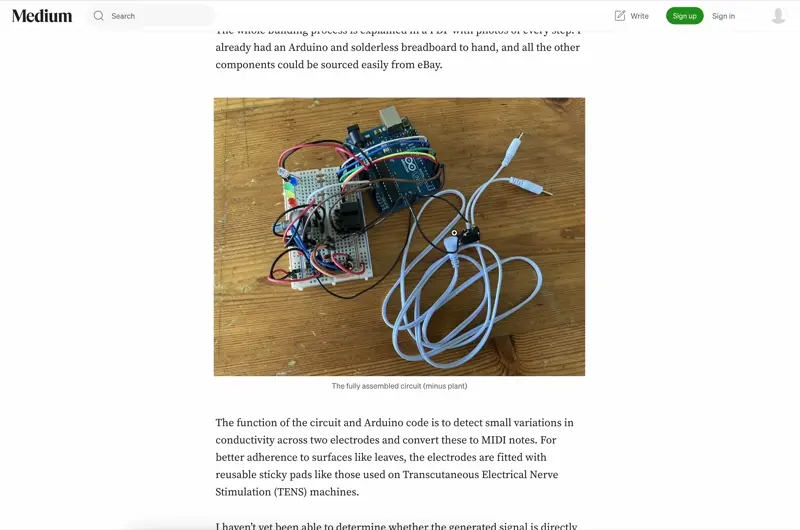

## Description

Despite the fact that pixels are free, and scrolling down to view more content is a convention that’s existed for decades, carousels are still a common solution for the perceived problem of having more content to display than there is space available.


Figure: This carousel from the top of Amazon.co.uk showcases everything from Ring doorbells to the latest Eddie Murphy movie. It seems more like an attempt to appease a disparate array of stakeholders than a means of helping users make informed choices.

Carousels come in all shapes and sizes but the core functionality is the same: content is split up into slides, and only a single slide or subset of slides are visible at any time.


Figure: Carousels with multiple visible items are a common feature of streaming apps. This example is from BBC iPlayer.

Navigating between slides is accomplished via one or more of the following methods (this list is non-exhaustive):

- Swipe gestures (on touchscreen devices and trackpads)
- Scrolling with a scroll wheel (some mouse wheels offer multiple axes for scrolling, in other cases vertical scrolling is translated to horizontal carousel movement)
- Using the arrow keys on a computer keyboard, directional pad on a game controller, or some other input device with physical buttons.
- Clicking or tapping on-screen right and left buttons
- Clicking on progress dots (a form of [pagination](/components/pagination)) to go to a specific slide

There are also some carousels in which the slides transition automatically without user input.

**Note: Just because a component can be scrolled horizontally, doesn’t mean that it’s a carousel**[^1]. Horizontal scrolling containers can be useful for displaying information that doesn’t easily fit into a narrow column. e.g. tables, spreadsheets, infographics etc. It can also be a stylistic choice. e.g. on the homepage of the [Van Gogh Museum](https://www.vangoghmuseum.nl/en).

## Accessibility

Carousels are inherently harder to make accessible than a simpler component, which is why most carousel implementations you’ll find aren't fully accessible. Even a carousel library which advertises accessibility can be used to build inaccessible carousels.

If you’re comfortable with the challenges involved, here are some of the techniques you should think about (without going into too many specifics of implementation):

### On-screen controls

Always provide on-screen controls for changing carousel slides. You can’t assume that all devices with small screens support touch gestures. Consider users who use a high zoom level[^2] or control their phone with an alternate input device.


Figure: The controls on this carousel example from the Grommet component library are barely visible over the image.

As with all web content, [ensure controls meet colour contrast requirements](https://www.w3.org/WAI/WCAG22/Understanding/non-text-contrast.html). Pay special attention to when controls appear on top of images: test with a variety of different images to ensure active and focus states have sufficient contrast.

You should also ensure that [touch targets are large enough](https://www.w3.org/WAI/WCAG22/Understanding/target-size-minimum) – at least 24px in diameter. Progress dots often fail this criterion.

### Hide inactive content

The content of inactive or invisible slides should be hidden from screen readers, and must not be focusable. Use the `inert` attribute (or a combination of `aria-hidden` and `tabindex="-1"`) to prevent both tabbing and discoverability.

If your carousel is designed to loop infinitely (i.e. clicking 'next' on the last slide takes you back to the first slide) be wary of users getting stuck in focus traps, where they cannot progress beyond the carousel.

### Respecting motion preferences

Auto-transitioning carousels are problematic for many reasons: they’re distracting, they ignore variable reading times, and they can cause issues with assistive technology.

If you absolutely must auto-transition between slides, always provide a play/pause control so users can stop this behaviour. You should also prevent the slide from transitioning whenever the cursor is hovering over the carousel or an element within the carousel is focused.

It's helpful to communicate how long the current side will be visible for – consider including a [progress bar](https://component.gallery/components/progress-bar/) or similar visual indicator.

Any transitions between slides should respect users’ motion preferences (on the web check for [`prefers-reduced-motion`](https://developer.mozilla.org/en-US/docs/Web/CSS/@media/prefers-reduced-motion)).

## Styling

You may have seen a [recent article](https://developer.chrome.com/blog/carousels-with-css) and some [impressive demos](https://chrome.dev/carousel/) for CSS-only carousels. At the time of writing these are still very much experimental and have a long way to go before they can be considered fully accessible[^3].

Until then, you’ll have to rely on JavaScript for the bulk of Carousel functionality. However there are some properties which can help minimise the amount of JavaScript required.

### CSS Scroll Snap


Figure: CSS Scroll Snap gives scrolling an elastic ‘snap’

With the use of [CSS Scroll Snap](https://developer.mozilla.org/en-US/docs/Web/CSS/CSS_scroll_snap) properties, you can restrict the possible scroll positions that a scroll container’s viewport may end at after a scrolling operation has completed. e.g. to centre an element in the viewport or align it to the left hand side.

In the following example, the outer element, `.carousel` is the scroll container, and `.slide` is used for children.

```css
.carousel {
  scroll-snap-type: x mandatory;
}

.slide {
  scroll-snap-align: start; /* align to the left edge (for ltr languages) */
}
```

### CSS Logical Properties

If there is any chance your site may be translated into a right-to-left language such as Arabic or Hebrew, you should make use of [CSS logical properties](https://web.dev/learn/css/logical-properties).

## Usage guidelines

Carousels are rarely the most efficient way for your users to accomplish a task – they‘re a compromise between different requirements. The internal goals of an organisation (or the preservation of some stakeholder’s fragile ego) are frequently prioritised over user needs.

Unfortunately, the decision whether to use a carousel is often out of the hands of an individual designer or developer. In these cases it’s up to those individuals to make the best of a bad situation.

### Discoverability

Putting content in a carousel is a surefire way of ensuring a large percentage of users will miss it. Never use carousels for essential information. There’s a place for exploratory interfaces, without an end goal, but these are a rare exception.

### Gestures

Allow users of touch devices to change slides with a swipe gesture. Take into account that in some browsers (including iOS Safari) the same gesture might be used for back/forward page navigation – set `overscroll-behavior-x: contain` (or `overscroll-behavior-inline` if you’re using CSS Logical Properties) to prevent accidental actions.

### Affordances


Figure: In this example from Channel 4, items are dynamically resized so there is always one item partially shown. The 'View all' link triggers an overlay showing the items in a grid view.

On websites at least (phone apps are a different matter), horizontal scrolling is far less intuitive than vertical scrolling. Always provide a visual affordance that there’s more content available. For example, by initially showing a part of the next slide, displaying a visible scrollbar, or adding a fade effect to the edge of the scrollable area.

## Alternatives

Before using a carousel, always consider other methods of displaying the same content. This can be as simple as laying your content out in a horizontal stack, or if you’re feeling adventurous, a grid.


Figure: In its default configuration, the [Gallery component from Flowbite](https://flowbite.com/docs/components/gallery/) takes images and displays them in a grid. It’s simple, looks good, and if you provide alt text, it’s accessible with minimal effort.

As an enhancement to a simple thumbnail grid, you can add functionality to expand each image on click. This lets users make an informed choice about what they want to see instead of having to scroll through every slide or waiting for the content they’re interested in to appear. For users who want a more exploratory experience, you can provide next and previous controls once in the expanded view.


Figure: Although they’re guilty of a multitude of sins, medium.com occasionally makes a good UX decision. Enabling users to expand images on click is one of their better ones.

If you’re trying to save space by using a carousel, perhaps you should consider an [Accordion](/components/accordion). These accomplish the same goal of saving space, while also having a couple of big advantages over carousels:

1. There’s a native HTML element, `details` which allows you to build them in an accessible way with minimal CSS and zero JavaScript.
2. The heading (or `summary` if you’re using a `details` element) lets you provide users with a summary of the content of each expandable section so they can make an informed choice about whether to expand it.

Lastly, why use a carousel when you can just show less stuff? If it’s important that a certain slide appears first, why not _only_ show that slide, and spend the time you would have spent building a carousel on something more important?

[^1]: …which is not to say that horizontal scrolling is without its problems, see [Horizontal Scrolling Containers Are Not a Content Strategy](https://adrianroselli.com/2025/08/horizontal-scrolling-containers-are-not-a-content-strategy.html) by Adrian Roselli

[^2]: For users who've set a 400% zoom, a 1280px wide screen acts more like a 320px one, see [Reflow (Level AA) on WCAG 2.2 Understanding Docs](https://www.w3.org/WAI/WCAG22/Understanding/reflow.html)

[^3]: [Are 'CSS Carousels' accessible?](https://www.sarasoueidan.com/blog/css-carousels-accessibility/) by Sara Soueidan
